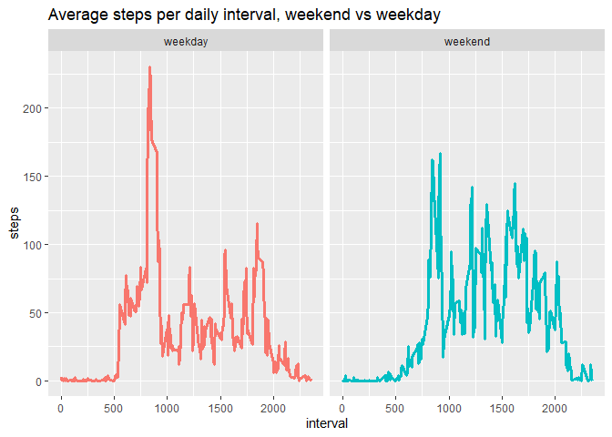

## Loading and preprocessing the data

```r
raw <- read.csv('activity.csv') %>% mutate(date = as.POSIXct(date, "%Y-%m-$d"))
```
Please note that the packages loaded for this assignment were tidyverse, formattable, zoo, ggplot2 and plotly. 


## What is mean total number of steps taken per day?

```r
steps_per_day <- raw %>% group_by(date) %>% summarise(steps_per_day = sum(steps, na.rm = T))

hist <- plot_ly(data = steps_per_day, nbinsx = 15, alpha = 0.6) %>% add_histogram(x = ~steps_per_day) %>% layout(title = 'Histogram of the number of steps taken per day',yaxis = list(title = "Frequency"),xaxis = list(title = "Daily steps"))
hist
```

<!--html_preserve--><div id="htmlwidget-6cfda54bb3c24b6166be" style="width:672px;height:480px;" class="plotly html-widget"></div>
<script type="application/json" data-for="htmlwidget-6cfda54bb3c24b6166be">{"x":{"visdat":{"74f82f99534a":["function () ","plotlyVisDat"]},"cur_data":"74f82f99534a","attrs":{"74f82f99534a":{"nbinsx":15,"alpha":0.6,"alpha_stroke":1,"sizes":[10,100],"spans":[1,20],"x":{},"type":"histogram","inherit":true}},"layout":{"margin":{"b":40,"l":60,"t":25,"r":10},"title":"Histogram of the number of steps taken per day","yaxis":{"domain":[0,1],"automargin":true,"title":"Frequency"},"xaxis":{"domain":[0,1],"automargin":true,"title":"Daily steps"},"hovermode":"closest","showlegend":false},"source":"A","config":{"showSendToCloud":false},"data":[{"nbinsx":15,"x":[0,126,11352,12116,13294,15420,11015,0,12811,9900,10304,17382,12426,15098,10139,15084,13452,10056,11829,10395,8821,13460,8918,8355,2492,6778,10119,11458,5018,9819,15414,0,10600,10571,0,10439,8334,12883,3219,0,0,12608,10765,7336,0,41,5441,14339,15110,8841,4472,12787,20427,21194,14478,11834,11162,13646,10183,7047,0],"type":"histogram","marker":{"color":"rgba(31,119,180,0.6)","line":{"color":"rgba(31,119,180,1)"}},"error_y":{"color":"rgba(31,119,180,0.6)"},"error_x":{"color":"rgba(31,119,180,0.6)"},"xaxis":"x","yaxis":"y","frame":null}],"highlight":{"on":"plotly_click","persistent":false,"dynamic":false,"selectize":false,"opacityDim":0.2,"selected":{"opacity":1},"debounce":0},"shinyEvents":["plotly_hover","plotly_click","plotly_selected","plotly_relayout","plotly_brushed","plotly_brushing","plotly_clickannotation","plotly_doubleclick","plotly_deselect","plotly_afterplot","plotly_sunburstclick"],"base_url":"https://plot.ly"},"evals":[],"jsHooks":[]}</script><!--/html_preserve-->

```r
paste0('The average number of steps taken per day is ',comma(mean(steps_per_day$steps_per_day),1),'.')
```

```
## [1] "The average number of steps taken per day is 9,354.2."
```

```r
paste0('The median number of steps taken per day is ',comma(median(steps_per_day$steps_per_day),0),'.')
```

```
## [1] "The median number of steps taken per day is 10,395."
```


## What is the average daily activity pattern?

```r
daily_pattern <- raw %>% group_by(interval) %>% summarise(mean_per_interval = mean(steps, na.rm = T))

daily_plot <- plot_ly(data = daily_pattern) %>% add_trace(x = ~interval, y = ~mean_per_interval, type = 'scatter', mode = 'lines',  hoverinfo = 'text', text = ~paste('<b>','</br> Interval: ','</b>',interval,'<b>','</br> Steps per interval: ','</b>', comma(mean_per_interval,1))) %>% layout(title = 'Mean steps per daily interval', yaxis = list(title = 'steps'), xaxis = list(title = 'interval'))
daily_plot
```

<!--html_preserve--><div id="htmlwidget-1a4e6aaa9b7b237fe2d4" style="width:672px;height:480px;" class="plotly html-widget"></div>
<script type="application/json" data-for="htmlwidget-1a4e6aaa9b7b237fe2d4">{"x":{"visdat":{"74f88c65729":["function () ","plotlyVisDat"]},"cur_data":"74f88c65729","attrs":{"74f88c65729":{"alpha_stroke":1,"sizes":[10,100],"spans":[1,20],"x":{},"y":{},"type":"scatter","mode":"lines","hoverinfo":"text","text":{},"inherit":true}},"layout":{"margin":{"b":40,"l":60,"t":25,"r":10},"title":"Mean steps per daily interval","yaxis":{"domain":[0,1],"automargin":true,"title":"steps"},"xaxis":{"domain":[0,1],"automargin":true,"title":"interval"},"hovermode":"closest","showlegend":false},"source":"A","config":{"showSendToCloud":false},"data":[{"x":[0,5,10,15,20,25,30,35,40,45,50,55,100,105,110,115,120,125,130,135,140,145,150,155,200,205,210,215,220,225,230,235,240,245,250,255,300,305,310,315,320,325,330,335,340,345,350,355,400,405,410,415,420,425,430,435,440,445,450,455,500,505,510,515,520,525,530,535,540,545,550,555,600,605,610,615,620,625,630,635,640,645,650,655,700,705,710,715,720,725,730,735,740,745,750,755,800,805,810,815,820,825,830,835,840,845,850,855,900,905,910,915,920,925,930,935,940,945,950,955,1000,1005,1010,1015,1020,1025,1030,1035,1040,1045,1050,1055,1100,1105,1110,1115,1120,1125,1130,1135,1140,1145,1150,1155,1200,1205,1210,1215,1220,1225,1230,1235,1240,1245,1250,1255,1300,1305,1310,1315,1320,1325,1330,1335,1340,1345,1350,1355,1400,1405,1410,1415,1420,1425,1430,1435,1440,1445,1450,1455,1500,1505,1510,1515,1520,1525,1530,1535,1540,1545,1550,1555,1600,1605,1610,1615,1620,1625,1630,1635,1640,1645,1650,1655,1700,1705,1710,1715,1720,1725,1730,1735,1740,1745,1750,1755,1800,1805,1810,1815,1820,1825,1830,1835,1840,1845,1850,1855,1900,1905,1910,1915,1920,1925,1930,1935,1940,1945,1950,1955,2000,2005,2010,2015,2020,2025,2030,2035,2040,2045,2050,2055,2100,2105,2110,2115,2120,2125,2130,2135,2140,2145,2150,2155,2200,2205,2210,2215,2220,2225,2230,2235,2240,2245,2250,2255,2300,2305,2310,2315,2320,2325,2330,2335,2340,2345,2350,2355],"y":[1.71698113207547,0.339622641509434,0.132075471698113,0.150943396226415,0.0754716981132075,2.09433962264151,0.528301886792453,0.867924528301887,0,1.47169811320755,0.30188679245283,0.132075471698113,0.320754716981132,0.679245283018868,0.150943396226415,0.339622641509434,0,1.11320754716981,1.83018867924528,0.169811320754717,0.169811320754717,0.377358490566038,0.264150943396226,0,0,0,1.13207547169811,0,0,0.132075471698113,0,0.226415094339623,0,0,1.54716981132075,0.943396226415094,0,0,0,0,0.207547169811321,0.622641509433962,1.62264150943396,0.584905660377358,0.490566037735849,0.0754716981132075,0,0,1.18867924528302,0.943396226415094,2.56603773584906,0,0.339622641509434,0.358490566037736,4.11320754716981,0.660377358490566,3.49056603773585,0.830188679245283,3.11320754716981,1.11320754716981,0,1.56603773584906,3,2.24528301886792,3.32075471698113,2.9622641509434,2.09433962264151,6.05660377358491,16.0188679245283,18.3396226415094,39.4528301886792,44.4905660377358,31.4905660377358,49.2641509433962,53.7735849056604,63.4528301886792,49.9622641509434,47.0754716981132,52.1509433962264,39.3396226415094,44.0188679245283,44.1698113207547,37.3584905660377,49.0377358490566,43.811320754717,44.377358490566,50.5094339622642,54.5094339622642,49.9245283018868,50.9811320754717,55.6792452830189,44.3207547169811,52.2641509433962,69.5471698113208,57.8490566037736,56.1509433962264,73.377358490566,68.2075471698113,129.433962264151,157.528301886792,171.150943396226,155.396226415094,177.301886792453,206.169811320755,195.924528301887,179.566037735849,183.396226415094,167.018867924528,143.452830188679,124.037735849057,109.11320754717,108.11320754717,103.716981132075,95.9622641509434,66.2075471698113,45.2264150943396,24.7924528301887,38.7547169811321,34.9811320754717,21.0566037735849,40.5660377358491,26.9811320754717,42.4150943396226,52.6603773584906,38.9245283018868,50.7924528301887,44.2830188679245,37.4150943396226,34.6981132075472,28.3396226415094,25.0943396226415,31.9433962264151,31.3584905660377,29.6792452830189,21.3207547169811,25.5471698113208,28.377358490566,26.4716981132075,33.4339622641509,49.9811320754717,42.0377358490566,44.6037735849057,46.0377358490566,59.188679245283,63.8679245283019,87.6981132075472,94.8490566037736,92.7735849056604,63.3962264150943,50.1698113207547,54.4716981132075,32.4150943396226,26.5283018867925,37.7358490566038,45.0566037735849,67.2830188679245,42.3396226415094,39.8867924528302,43.2641509433962,40.9811320754717,46.2452830188679,56.4339622641509,42.7547169811321,25.1320754716981,39.9622641509434,53.5471698113208,47.3207547169811,60.811320754717,55.7547169811321,51.9622641509434,43.5849056603774,48.6981132075472,35.4716981132075,37.5471698113208,41.8490566037736,27.5094339622642,17.1132075471698,26.0754716981132,43.622641509434,43.7735849056604,30.0188679245283,36.0754716981132,35.4905660377358,38.8490566037736,45.9622641509434,47.7547169811321,48.1320754716981,65.3207547169811,82.9056603773585,98.6603773584906,102.11320754717,83.9622641509434,62.1320754716981,64.1320754716981,74.5471698113208,63.1698113207547,56.9056603773585,59.7735849056604,43.8679245283019,38.5660377358491,44.6603773584906,45.4528301886792,46.2075471698113,43.6792452830189,46.622641509434,56.3018867924528,50.7169811320755,61.2264150943396,72.7169811320755,78.9433962264151,68.9433962264151,59.6603773584906,75.0943396226415,56.5094339622642,34.7735849056604,37.4528301886792,40.6792452830189,58.0188679245283,74.6981132075472,85.3207547169811,59.2641509433962,67.7735849056604,77.6981132075472,74.2452830188679,85.3396226415094,99.4528301886792,86.5849056603774,85.6037735849057,84.8679245283019,77.8301886792453,58.0377358490566,53.3584905660377,36.3207547169811,20.7169811320755,27.3962264150943,40.0188679245283,30.2075471698113,25.5471698113208,45.6603773584906,33.5283018867925,19.622641509434,19.0188679245283,19.3396226415094,33.3396226415094,26.811320754717,21.1698113207547,27.3018867924528,21.3396226415094,19.5471698113208,21.3207547169811,32.3018867924528,20.1509433962264,15.9433962264151,17.2264150943396,23.4528301886792,19.2452830188679,12.4528301886792,8.0188679245283,14.6603773584906,16.3018867924528,8.67924528301887,7.79245283018868,8.13207547169811,2.62264150943396,1.45283018867925,3.67924528301887,4.81132075471698,8.50943396226415,7.07547169811321,8.69811320754717,9.75471698113208,2.20754716981132,0.320754716981132,0.113207547169811,1.60377358490566,4.60377358490566,3.30188679245283,2.84905660377358,0,0.830188679245283,0.962264150943396,1.58490566037736,2.60377358490566,4.69811320754717,3.30188679245283,0.641509433962264,0.226415094339623,1.07547169811321],"type":"scatter","mode":"lines","hoverinfo":["text","text","text","text","text","text","text","text","text","text","text","text","text","text","text","text","text","text","text","text","text","text","text","text","text","text","text","text","text","text","text","text","text","text","text","text","text","text","text","text","text","text","text","text","text","text","text","text","text","text","text","text","text","text","text","text","text","text","text","text","text","text","text","text","text","text","text","text","text","text","text","text","text","text","text","text","text","text","text","text","text","text","text","text","text","text","text","text","text","text","text","text","text","text","text","text","text","text","text","text","text","text","text","text","text","text","text","text","text","text","text","text","text","text","text","text","text","text","text","text","text","text","text","text","text","text","text","text","text","text","text","text","text","text","text","text","text","text","text","text","text","text","text","text","text","text","text","text","text","text","text","text","text","text","text","text","text","text","text","text","text","text","text","text","text","text","text","text","text","text","text","text","text","text","text","text","text","text","text","text","text","text","text","text","text","text","text","text","text","text","text","text","text","text","text","text","text","text","text","text","text","text","text","text","text","text","text","text","text","text","text","text","text","text","text","text","text","text","text","text","text","text","text","text","text","text","text","text","text","text","text","text","text","text","text","text","text","text","text","text","text","text","text","text","text","text","text","text","text","text","text","text","text","text","text","text","text","text","text","text","text","text","text","text","text","text","text","text","text","text","text","text","text","text","text","text","text","text","text","text","text","text","text","text","text","text","text","text"],"text":["<b> <\/br> Interval:  <\/b> 0 <b> <\/br> Steps per interval:  <\/b> 1.7","<b> <\/br> Interval:  <\/b> 5 <b> <\/br> Steps per interval:  <\/b> 0.3","<b> <\/br> Interval:  <\/b> 10 <b> <\/br> Steps per interval:  <\/b> 0.1","<b> <\/br> Interval:  <\/b> 15 <b> <\/br> Steps per interval:  <\/b> 0.2","<b> <\/br> Interval:  <\/b> 20 <b> <\/br> Steps per interval:  <\/b> 0.1","<b> <\/br> Interval:  <\/b> 25 <b> <\/br> Steps per interval:  <\/b> 2.1","<b> <\/br> Interval:  <\/b> 30 <b> <\/br> Steps per interval:  <\/b> 0.5","<b> <\/br> Interval:  <\/b> 35 <b> <\/br> Steps per interval:  <\/b> 0.9","<b> <\/br> Interval:  <\/b> 40 <b> <\/br> Steps per interval:  <\/b> 0.0","<b> <\/br> Interval:  <\/b> 45 <b> <\/br> Steps per interval:  <\/b> 1.5","<b> <\/br> Interval:  <\/b> 50 <b> <\/br> Steps per interval:  <\/b> 0.3","<b> <\/br> Interval:  <\/b> 55 <b> <\/br> Steps per interval:  <\/b> 0.1","<b> <\/br> Interval:  <\/b> 100 <b> <\/br> Steps per interval:  <\/b> 0.3","<b> <\/br> Interval:  <\/b> 105 <b> <\/br> Steps per interval:  <\/b> 0.7","<b> <\/br> Interval:  <\/b> 110 <b> <\/br> Steps per interval:  <\/b> 0.2","<b> <\/br> Interval:  <\/b> 115 <b> <\/br> Steps per interval:  <\/b> 0.3","<b> <\/br> Interval:  <\/b> 120 <b> <\/br> Steps per interval:  <\/b> 0.0","<b> <\/br> Interval:  <\/b> 125 <b> <\/br> Steps per interval:  <\/b> 1.1","<b> <\/br> Interval:  <\/b> 130 <b> <\/br> Steps per interval:  <\/b> 1.8","<b> <\/br> Interval:  <\/b> 135 <b> <\/br> Steps per interval:  <\/b> 0.2","<b> <\/br> Interval:  <\/b> 140 <b> <\/br> Steps per interval:  <\/b> 0.2","<b> <\/br> Interval:  <\/b> 145 <b> <\/br> Steps per interval:  <\/b> 0.4","<b> <\/br> Interval:  <\/b> 150 <b> <\/br> Steps per interval:  <\/b> 0.3","<b> <\/br> Interval:  <\/b> 155 <b> <\/br> Steps per interval:  <\/b> 0.0","<b> <\/br> Interval:  <\/b> 200 <b> <\/br> Steps per interval:  <\/b> 0.0","<b> <\/br> Interval:  <\/b> 205 <b> <\/br> Steps per interval:  <\/b> 0.0","<b> <\/br> Interval:  <\/b> 210 <b> <\/br> Steps per interval:  <\/b> 1.1","<b> <\/br> Interval:  <\/b> 215 <b> <\/br> Steps per interval:  <\/b> 0.0","<b> <\/br> Interval:  <\/b> 220 <b> <\/br> Steps per interval:  <\/b> 0.0","<b> <\/br> Interval:  <\/b> 225 <b> <\/br> Steps per interval:  <\/b> 0.1","<b> <\/br> Interval:  <\/b> 230 <b> <\/br> Steps per interval:  <\/b> 0.0","<b> <\/br> Interval:  <\/b> 235 <b> <\/br> Steps per interval:  <\/b> 0.2","<b> <\/br> Interval:  <\/b> 240 <b> <\/br> Steps per interval:  <\/b> 0.0","<b> <\/br> Interval:  <\/b> 245 <b> <\/br> Steps per interval:  <\/b> 0.0","<b> <\/br> Interval:  <\/b> 250 <b> <\/br> Steps per interval:  <\/b> 1.5","<b> <\/br> Interval:  <\/b> 255 <b> <\/br> Steps per interval:  <\/b> 0.9","<b> <\/br> Interval:  <\/b> 300 <b> <\/br> Steps per interval:  <\/b> 0.0","<b> <\/br> Interval:  <\/b> 305 <b> <\/br> Steps per interval:  <\/b> 0.0","<b> <\/br> Interval:  <\/b> 310 <b> <\/br> Steps per interval:  <\/b> 0.0","<b> <\/br> Interval:  <\/b> 315 <b> <\/br> Steps per interval:  <\/b> 0.0","<b> <\/br> Interval:  <\/b> 320 <b> <\/br> Steps per interval:  <\/b> 0.2","<b> <\/br> Interval:  <\/b> 325 <b> <\/br> Steps per interval:  <\/b> 0.6","<b> <\/br> Interval:  <\/b> 330 <b> <\/br> Steps per interval:  <\/b> 1.6","<b> <\/br> Interval:  <\/b> 335 <b> <\/br> Steps per interval:  <\/b> 0.6","<b> <\/br> Interval:  <\/b> 340 <b> <\/br> Steps per interval:  <\/b> 0.5","<b> <\/br> Interval:  <\/b> 345 <b> <\/br> Steps per interval:  <\/b> 0.1","<b> <\/br> Interval:  <\/b> 350 <b> <\/br> Steps per interval:  <\/b> 0.0","<b> <\/br> Interval:  <\/b> 355 <b> <\/br> Steps per interval:  <\/b> 0.0","<b> <\/br> Interval:  <\/b> 400 <b> <\/br> Steps per interval:  <\/b> 1.2","<b> <\/br> Interval:  <\/b> 405 <b> <\/br> Steps per interval:  <\/b> 0.9","<b> <\/br> Interval:  <\/b> 410 <b> <\/br> Steps per interval:  <\/b> 2.6","<b> <\/br> Interval:  <\/b> 415 <b> <\/br> Steps per interval:  <\/b> 0.0","<b> <\/br> Interval:  <\/b> 420 <b> <\/br> Steps per interval:  <\/b> 0.3","<b> <\/br> Interval:  <\/b> 425 <b> <\/br> Steps per interval:  <\/b> 0.4","<b> <\/br> Interval:  <\/b> 430 <b> <\/br> Steps per interval:  <\/b> 4.1","<b> <\/br> Interval:  <\/b> 435 <b> <\/br> Steps per interval:  <\/b> 0.7","<b> <\/br> Interval:  <\/b> 440 <b> <\/br> Steps per interval:  <\/b> 3.5","<b> <\/br> Interval:  <\/b> 445 <b> <\/br> Steps per interval:  <\/b> 0.8","<b> <\/br> Interval:  <\/b> 450 <b> <\/br> Steps per interval:  <\/b> 3.1","<b> <\/br> Interval:  <\/b> 455 <b> <\/br> Steps per interval:  <\/b> 1.1","<b> <\/br> Interval:  <\/b> 500 <b> <\/br> Steps per interval:  <\/b> 0.0","<b> <\/br> Interval:  <\/b> 505 <b> <\/br> Steps per interval:  <\/b> 1.6","<b> <\/br> Interval:  <\/b> 510 <b> <\/br> Steps per interval:  <\/b> 3.0","<b> <\/br> Interval:  <\/b> 515 <b> <\/br> Steps per interval:  <\/b> 2.2","<b> <\/br> Interval:  <\/b> 520 <b> <\/br> Steps per interval:  <\/b> 3.3","<b> <\/br> Interval:  <\/b> 525 <b> <\/br> Steps per interval:  <\/b> 3.0","<b> <\/br> Interval:  <\/b> 530 <b> <\/br> Steps per interval:  <\/b> 2.1","<b> <\/br> Interval:  <\/b> 535 <b> <\/br> Steps per interval:  <\/b> 6.1","<b> <\/br> Interval:  <\/b> 540 <b> <\/br> Steps per interval:  <\/b> 16.0","<b> <\/br> Interval:  <\/b> 545 <b> <\/br> Steps per interval:  <\/b> 18.3","<b> <\/br> Interval:  <\/b> 550 <b> <\/br> Steps per interval:  <\/b> 39.5","<b> <\/br> Interval:  <\/b> 555 <b> <\/br> Steps per interval:  <\/b> 44.5","<b> <\/br> Interval:  <\/b> 600 <b> <\/br> Steps per interval:  <\/b> 31.5","<b> <\/br> Interval:  <\/b> 605 <b> <\/br> Steps per interval:  <\/b> 49.3","<b> <\/br> Interval:  <\/b> 610 <b> <\/br> Steps per interval:  <\/b> 53.8","<b> <\/br> Interval:  <\/b> 615 <b> <\/br> Steps per interval:  <\/b> 63.5","<b> <\/br> Interval:  <\/b> 620 <b> <\/br> Steps per interval:  <\/b> 50.0","<b> <\/br> Interval:  <\/b> 625 <b> <\/br> Steps per interval:  <\/b> 47.1","<b> <\/br> Interval:  <\/b> 630 <b> <\/br> Steps per interval:  <\/b> 52.2","<b> <\/br> Interval:  <\/b> 635 <b> <\/br> Steps per interval:  <\/b> 39.3","<b> <\/br> Interval:  <\/b> 640 <b> <\/br> Steps per interval:  <\/b> 44.0","<b> <\/br> Interval:  <\/b> 645 <b> <\/br> Steps per interval:  <\/b> 44.2","<b> <\/br> Interval:  <\/b> 650 <b> <\/br> Steps per interval:  <\/b> 37.4","<b> <\/br> Interval:  <\/b> 655 <b> <\/br> Steps per interval:  <\/b> 49.0","<b> <\/br> Interval:  <\/b> 700 <b> <\/br> Steps per interval:  <\/b> 43.8","<b> <\/br> Interval:  <\/b> 705 <b> <\/br> Steps per interval:  <\/b> 44.4","<b> <\/br> Interval:  <\/b> 710 <b> <\/br> Steps per interval:  <\/b> 50.5","<b> <\/br> Interval:  <\/b> 715 <b> <\/br> Steps per interval:  <\/b> 54.5","<b> <\/br> Interval:  <\/b> 720 <b> <\/br> Steps per interval:  <\/b> 49.9","<b> <\/br> Interval:  <\/b> 725 <b> <\/br> Steps per interval:  <\/b> 51.0","<b> <\/br> Interval:  <\/b> 730 <b> <\/br> Steps per interval:  <\/b> 55.7","<b> <\/br> Interval:  <\/b> 735 <b> <\/br> Steps per interval:  <\/b> 44.3","<b> <\/br> Interval:  <\/b> 740 <b> <\/br> Steps per interval:  <\/b> 52.3","<b> <\/br> Interval:  <\/b> 745 <b> <\/br> Steps per interval:  <\/b> 69.5","<b> <\/br> Interval:  <\/b> 750 <b> <\/br> Steps per interval:  <\/b> 57.8","<b> <\/br> Interval:  <\/b> 755 <b> <\/br> Steps per interval:  <\/b> 56.2","<b> <\/br> Interval:  <\/b> 800 <b> <\/br> Steps per interval:  <\/b> 73.4","<b> <\/br> Interval:  <\/b> 805 <b> <\/br> Steps per interval:  <\/b> 68.2","<b> <\/br> Interval:  <\/b> 810 <b> <\/br> Steps per interval:  <\/b> 129.4","<b> <\/br> Interval:  <\/b> 815 <b> <\/br> Steps per interval:  <\/b> 157.5","<b> <\/br> Interval:  <\/b> 820 <b> <\/br> Steps per interval:  <\/b> 171.2","<b> <\/br> Interval:  <\/b> 825 <b> <\/br> Steps per interval:  <\/b> 155.4","<b> <\/br> Interval:  <\/b> 830 <b> <\/br> Steps per interval:  <\/b> 177.3","<b> <\/br> Interval:  <\/b> 835 <b> <\/br> Steps per interval:  <\/b> 206.2","<b> <\/br> Interval:  <\/b> 840 <b> <\/br> Steps per interval:  <\/b> 195.9","<b> <\/br> Interval:  <\/b> 845 <b> <\/br> Steps per interval:  <\/b> 179.6","<b> <\/br> Interval:  <\/b> 850 <b> <\/br> Steps per interval:  <\/b> 183.4","<b> <\/br> Interval:  <\/b> 855 <b> <\/br> Steps per interval:  <\/b> 167.0","<b> <\/br> Interval:  <\/b> 900 <b> <\/br> Steps per interval:  <\/b> 143.5","<b> <\/br> Interval:  <\/b> 905 <b> <\/br> Steps per interval:  <\/b> 124.0","<b> <\/br> Interval:  <\/b> 910 <b> <\/br> Steps per interval:  <\/b> 109.1","<b> <\/br> Interval:  <\/b> 915 <b> <\/br> Steps per interval:  <\/b> 108.1","<b> <\/br> Interval:  <\/b> 920 <b> <\/br> Steps per interval:  <\/b> 103.7","<b> <\/br> Interval:  <\/b> 925 <b> <\/br> Steps per interval:  <\/b> 96.0","<b> <\/br> Interval:  <\/b> 930 <b> <\/br> Steps per interval:  <\/b> 66.2","<b> <\/br> Interval:  <\/b> 935 <b> <\/br> Steps per interval:  <\/b> 45.2","<b> <\/br> Interval:  <\/b> 940 <b> <\/br> Steps per interval:  <\/b> 24.8","<b> <\/br> Interval:  <\/b> 945 <b> <\/br> Steps per interval:  <\/b> 38.8","<b> <\/br> Interval:  <\/b> 950 <b> <\/br> Steps per interval:  <\/b> 35.0","<b> <\/br> Interval:  <\/b> 955 <b> <\/br> Steps per interval:  <\/b> 21.1","<b> <\/br> Interval:  <\/b> 1000 <b> <\/br> Steps per interval:  <\/b> 40.6","<b> <\/br> Interval:  <\/b> 1005 <b> <\/br> Steps per interval:  <\/b> 27.0","<b> <\/br> Interval:  <\/b> 1010 <b> <\/br> Steps per interval:  <\/b> 42.4","<b> <\/br> Interval:  <\/b> 1015 <b> <\/br> Steps per interval:  <\/b> 52.7","<b> <\/br> Interval:  <\/b> 1020 <b> <\/br> Steps per interval:  <\/b> 38.9","<b> <\/br> Interval:  <\/b> 1025 <b> <\/br> Steps per interval:  <\/b> 50.8","<b> <\/br> Interval:  <\/b> 1030 <b> <\/br> Steps per interval:  <\/b> 44.3","<b> <\/br> Interval:  <\/b> 1035 <b> <\/br> Steps per interval:  <\/b> 37.4","<b> <\/br> Interval:  <\/b> 1040 <b> <\/br> Steps per interval:  <\/b> 34.7","<b> <\/br> Interval:  <\/b> 1045 <b> <\/br> Steps per interval:  <\/b> 28.3","<b> <\/br> Interval:  <\/b> 1050 <b> <\/br> Steps per interval:  <\/b> 25.1","<b> <\/br> Interval:  <\/b> 1055 <b> <\/br> Steps per interval:  <\/b> 31.9","<b> <\/br> Interval:  <\/b> 1100 <b> <\/br> Steps per interval:  <\/b> 31.4","<b> <\/br> Interval:  <\/b> 1105 <b> <\/br> Steps per interval:  <\/b> 29.7","<b> <\/br> Interval:  <\/b> 1110 <b> <\/br> Steps per interval:  <\/b> 21.3","<b> <\/br> Interval:  <\/b> 1115 <b> <\/br> Steps per interval:  <\/b> 25.5","<b> <\/br> Interval:  <\/b> 1120 <b> <\/br> Steps per interval:  <\/b> 28.4","<b> <\/br> Interval:  <\/b> 1125 <b> <\/br> Steps per interval:  <\/b> 26.5","<b> <\/br> Interval:  <\/b> 1130 <b> <\/br> Steps per interval:  <\/b> 33.4","<b> <\/br> Interval:  <\/b> 1135 <b> <\/br> Steps per interval:  <\/b> 50.0","<b> <\/br> Interval:  <\/b> 1140 <b> <\/br> Steps per interval:  <\/b> 42.0","<b> <\/br> Interval:  <\/b> 1145 <b> <\/br> Steps per interval:  <\/b> 44.6","<b> <\/br> Interval:  <\/b> 1150 <b> <\/br> Steps per interval:  <\/b> 46.0","<b> <\/br> Interval:  <\/b> 1155 <b> <\/br> Steps per interval:  <\/b> 59.2","<b> <\/br> Interval:  <\/b> 1200 <b> <\/br> Steps per interval:  <\/b> 63.9","<b> <\/br> Interval:  <\/b> 1205 <b> <\/br> Steps per interval:  <\/b> 87.7","<b> <\/br> Interval:  <\/b> 1210 <b> <\/br> Steps per interval:  <\/b> 94.8","<b> <\/br> Interval:  <\/b> 1215 <b> <\/br> Steps per interval:  <\/b> 92.8","<b> <\/br> Interval:  <\/b> 1220 <b> <\/br> Steps per interval:  <\/b> 63.4","<b> <\/br> Interval:  <\/b> 1225 <b> <\/br> Steps per interval:  <\/b> 50.2","<b> <\/br> Interval:  <\/b> 1230 <b> <\/br> Steps per interval:  <\/b> 54.5","<b> <\/br> Interval:  <\/b> 1235 <b> <\/br> Steps per interval:  <\/b> 32.4","<b> <\/br> Interval:  <\/b> 1240 <b> <\/br> Steps per interval:  <\/b> 26.5","<b> <\/br> Interval:  <\/b> 1245 <b> <\/br> Steps per interval:  <\/b> 37.7","<b> <\/br> Interval:  <\/b> 1250 <b> <\/br> Steps per interval:  <\/b> 45.1","<b> <\/br> Interval:  <\/b> 1255 <b> <\/br> Steps per interval:  <\/b> 67.3","<b> <\/br> Interval:  <\/b> 1300 <b> <\/br> Steps per interval:  <\/b> 42.3","<b> <\/br> Interval:  <\/b> 1305 <b> <\/br> Steps per interval:  <\/b> 39.9","<b> <\/br> Interval:  <\/b> 1310 <b> <\/br> Steps per interval:  <\/b> 43.3","<b> <\/br> Interval:  <\/b> 1315 <b> <\/br> Steps per interval:  <\/b> 41.0","<b> <\/br> Interval:  <\/b> 1320 <b> <\/br> Steps per interval:  <\/b> 46.2","<b> <\/br> Interval:  <\/b> 1325 <b> <\/br> Steps per interval:  <\/b> 56.4","<b> <\/br> Interval:  <\/b> 1330 <b> <\/br> Steps per interval:  <\/b> 42.8","<b> <\/br> Interval:  <\/b> 1335 <b> <\/br> Steps per interval:  <\/b> 25.1","<b> <\/br> Interval:  <\/b> 1340 <b> <\/br> Steps per interval:  <\/b> 40.0","<b> <\/br> Interval:  <\/b> 1345 <b> <\/br> Steps per interval:  <\/b> 53.5","<b> <\/br> Interval:  <\/b> 1350 <b> <\/br> Steps per interval:  <\/b> 47.3","<b> <\/br> Interval:  <\/b> 1355 <b> <\/br> Steps per interval:  <\/b> 60.8","<b> <\/br> Interval:  <\/b> 1400 <b> <\/br> Steps per interval:  <\/b> 55.8","<b> <\/br> Interval:  <\/b> 1405 <b> <\/br> Steps per interval:  <\/b> 52.0","<b> <\/br> Interval:  <\/b> 1410 <b> <\/br> Steps per interval:  <\/b> 43.6","<b> <\/br> Interval:  <\/b> 1415 <b> <\/br> Steps per interval:  <\/b> 48.7","<b> <\/br> Interval:  <\/b> 1420 <b> <\/br> Steps per interval:  <\/b> 35.5","<b> <\/br> Interval:  <\/b> 1425 <b> <\/br> Steps per interval:  <\/b> 37.5","<b> <\/br> Interval:  <\/b> 1430 <b> <\/br> Steps per interval:  <\/b> 41.8","<b> <\/br> Interval:  <\/b> 1435 <b> <\/br> Steps per interval:  <\/b> 27.5","<b> <\/br> Interval:  <\/b> 1440 <b> <\/br> Steps per interval:  <\/b> 17.1","<b> <\/br> Interval:  <\/b> 1445 <b> <\/br> Steps per interval:  <\/b> 26.1","<b> <\/br> Interval:  <\/b> 1450 <b> <\/br> Steps per interval:  <\/b> 43.6","<b> <\/br> Interval:  <\/b> 1455 <b> <\/br> Steps per interval:  <\/b> 43.8","<b> <\/br> Interval:  <\/b> 1500 <b> <\/br> Steps per interval:  <\/b> 30.0","<b> <\/br> Interval:  <\/b> 1505 <b> <\/br> Steps per interval:  <\/b> 36.1","<b> <\/br> Interval:  <\/b> 1510 <b> <\/br> Steps per interval:  <\/b> 35.5","<b> <\/br> Interval:  <\/b> 1515 <b> <\/br> Steps per interval:  <\/b> 38.8","<b> <\/br> Interval:  <\/b> 1520 <b> <\/br> Steps per interval:  <\/b> 46.0","<b> <\/br> Interval:  <\/b> 1525 <b> <\/br> Steps per interval:  <\/b> 47.8","<b> <\/br> Interval:  <\/b> 1530 <b> <\/br> Steps per interval:  <\/b> 48.1","<b> <\/br> Interval:  <\/b> 1535 <b> <\/br> Steps per interval:  <\/b> 65.3","<b> <\/br> Interval:  <\/b> 1540 <b> <\/br> Steps per interval:  <\/b> 82.9","<b> <\/br> Interval:  <\/b> 1545 <b> <\/br> Steps per interval:  <\/b> 98.7","<b> <\/br> Interval:  <\/b> 1550 <b> <\/br> Steps per interval:  <\/b> 102.1","<b> <\/br> Interval:  <\/b> 1555 <b> <\/br> Steps per interval:  <\/b> 84.0","<b> <\/br> Interval:  <\/b> 1600 <b> <\/br> Steps per interval:  <\/b> 62.1","<b> <\/br> Interval:  <\/b> 1605 <b> <\/br> Steps per interval:  <\/b> 64.1","<b> <\/br> Interval:  <\/b> 1610 <b> <\/br> Steps per interval:  <\/b> 74.5","<b> <\/br> Interval:  <\/b> 1615 <b> <\/br> Steps per interval:  <\/b> 63.2","<b> <\/br> Interval:  <\/b> 1620 <b> <\/br> Steps per interval:  <\/b> 56.9","<b> <\/br> Interval:  <\/b> 1625 <b> <\/br> Steps per interval:  <\/b> 59.8","<b> <\/br> Interval:  <\/b> 1630 <b> <\/br> Steps per interval:  <\/b> 43.9","<b> <\/br> Interval:  <\/b> 1635 <b> <\/br> Steps per interval:  <\/b> 38.6","<b> <\/br> Interval:  <\/b> 1640 <b> <\/br> Steps per interval:  <\/b> 44.7","<b> <\/br> Interval:  <\/b> 1645 <b> <\/br> Steps per interval:  <\/b> 45.5","<b> <\/br> Interval:  <\/b> 1650 <b> <\/br> Steps per interval:  <\/b> 46.2","<b> <\/br> Interval:  <\/b> 1655 <b> <\/br> Steps per interval:  <\/b> 43.7","<b> <\/br> Interval:  <\/b> 1700 <b> <\/br> Steps per interval:  <\/b> 46.6","<b> <\/br> Interval:  <\/b> 1705 <b> <\/br> Steps per interval:  <\/b> 56.3","<b> <\/br> Interval:  <\/b> 1710 <b> <\/br> Steps per interval:  <\/b> 50.7","<b> <\/br> Interval:  <\/b> 1715 <b> <\/br> Steps per interval:  <\/b> 61.2","<b> <\/br> Interval:  <\/b> 1720 <b> <\/br> Steps per interval:  <\/b> 72.7","<b> <\/br> Interval:  <\/b> 1725 <b> <\/br> Steps per interval:  <\/b> 78.9","<b> <\/br> Interval:  <\/b> 1730 <b> <\/br> Steps per interval:  <\/b> 68.9","<b> <\/br> Interval:  <\/b> 1735 <b> <\/br> Steps per interval:  <\/b> 59.7","<b> <\/br> Interval:  <\/b> 1740 <b> <\/br> Steps per interval:  <\/b> 75.1","<b> <\/br> Interval:  <\/b> 1745 <b> <\/br> Steps per interval:  <\/b> 56.5","<b> <\/br> Interval:  <\/b> 1750 <b> <\/br> Steps per interval:  <\/b> 34.8","<b> <\/br> Interval:  <\/b> 1755 <b> <\/br> Steps per interval:  <\/b> 37.5","<b> <\/br> Interval:  <\/b> 1800 <b> <\/br> Steps per interval:  <\/b> 40.7","<b> <\/br> Interval:  <\/b> 1805 <b> <\/br> Steps per interval:  <\/b> 58.0","<b> <\/br> Interval:  <\/b> 1810 <b> <\/br> Steps per interval:  <\/b> 74.7","<b> <\/br> Interval:  <\/b> 1815 <b> <\/br> Steps per interval:  <\/b> 85.3","<b> <\/br> Interval:  <\/b> 1820 <b> <\/br> Steps per interval:  <\/b> 59.3","<b> <\/br> Interval:  <\/b> 1825 <b> <\/br> Steps per interval:  <\/b> 67.8","<b> <\/br> Interval:  <\/b> 1830 <b> <\/br> Steps per interval:  <\/b> 77.7","<b> <\/br> Interval:  <\/b> 1835 <b> <\/br> Steps per interval:  <\/b> 74.2","<b> <\/br> Interval:  <\/b> 1840 <b> <\/br> Steps per interval:  <\/b> 85.3","<b> <\/br> Interval:  <\/b> 1845 <b> <\/br> Steps per interval:  <\/b> 99.5","<b> <\/br> Interval:  <\/b> 1850 <b> <\/br> Steps per interval:  <\/b> 86.6","<b> <\/br> Interval:  <\/b> 1855 <b> <\/br> Steps per interval:  <\/b> 85.6","<b> <\/br> Interval:  <\/b> 1900 <b> <\/br> Steps per interval:  <\/b> 84.9","<b> <\/br> Interval:  <\/b> 1905 <b> <\/br> Steps per interval:  <\/b> 77.8","<b> <\/br> Interval:  <\/b> 1910 <b> <\/br> Steps per interval:  <\/b> 58.0","<b> <\/br> Interval:  <\/b> 1915 <b> <\/br> Steps per interval:  <\/b> 53.4","<b> <\/br> Interval:  <\/b> 1920 <b> <\/br> Steps per interval:  <\/b> 36.3","<b> <\/br> Interval:  <\/b> 1925 <b> <\/br> Steps per interval:  <\/b> 20.7","<b> <\/br> Interval:  <\/b> 1930 <b> <\/br> Steps per interval:  <\/b> 27.4","<b> <\/br> Interval:  <\/b> 1935 <b> <\/br> Steps per interval:  <\/b> 40.0","<b> <\/br> Interval:  <\/b> 1940 <b> <\/br> Steps per interval:  <\/b> 30.2","<b> <\/br> Interval:  <\/b> 1945 <b> <\/br> Steps per interval:  <\/b> 25.5","<b> <\/br> Interval:  <\/b> 1950 <b> <\/br> Steps per interval:  <\/b> 45.7","<b> <\/br> Interval:  <\/b> 1955 <b> <\/br> Steps per interval:  <\/b> 33.5","<b> <\/br> Interval:  <\/b> 2000 <b> <\/br> Steps per interval:  <\/b> 19.6","<b> <\/br> Interval:  <\/b> 2005 <b> <\/br> Steps per interval:  <\/b> 19.0","<b> <\/br> Interval:  <\/b> 2010 <b> <\/br> Steps per interval:  <\/b> 19.3","<b> <\/br> Interval:  <\/b> 2015 <b> <\/br> Steps per interval:  <\/b> 33.3","<b> <\/br> Interval:  <\/b> 2020 <b> <\/br> Steps per interval:  <\/b> 26.8","<b> <\/br> Interval:  <\/b> 2025 <b> <\/br> Steps per interval:  <\/b> 21.2","<b> <\/br> Interval:  <\/b> 2030 <b> <\/br> Steps per interval:  <\/b> 27.3","<b> <\/br> Interval:  <\/b> 2035 <b> <\/br> Steps per interval:  <\/b> 21.3","<b> <\/br> Interval:  <\/b> 2040 <b> <\/br> Steps per interval:  <\/b> 19.5","<b> <\/br> Interval:  <\/b> 2045 <b> <\/br> Steps per interval:  <\/b> 21.3","<b> <\/br> Interval:  <\/b> 2050 <b> <\/br> Steps per interval:  <\/b> 32.3","<b> <\/br> Interval:  <\/b> 2055 <b> <\/br> Steps per interval:  <\/b> 20.2","<b> <\/br> Interval:  <\/b> 2100 <b> <\/br> Steps per interval:  <\/b> 15.9","<b> <\/br> Interval:  <\/b> 2105 <b> <\/br> Steps per interval:  <\/b> 17.2","<b> <\/br> Interval:  <\/b> 2110 <b> <\/br> Steps per interval:  <\/b> 23.5","<b> <\/br> Interval:  <\/b> 2115 <b> <\/br> Steps per interval:  <\/b> 19.2","<b> <\/br> Interval:  <\/b> 2120 <b> <\/br> Steps per interval:  <\/b> 12.5","<b> <\/br> Interval:  <\/b> 2125 <b> <\/br> Steps per interval:  <\/b> 8.0","<b> <\/br> Interval:  <\/b> 2130 <b> <\/br> Steps per interval:  <\/b> 14.7","<b> <\/br> Interval:  <\/b> 2135 <b> <\/br> Steps per interval:  <\/b> 16.3","<b> <\/br> Interval:  <\/b> 2140 <b> <\/br> Steps per interval:  <\/b> 8.7","<b> <\/br> Interval:  <\/b> 2145 <b> <\/br> Steps per interval:  <\/b> 7.8","<b> <\/br> Interval:  <\/b> 2150 <b> <\/br> Steps per interval:  <\/b> 8.1","<b> <\/br> Interval:  <\/b> 2155 <b> <\/br> Steps per interval:  <\/b> 2.6","<b> <\/br> Interval:  <\/b> 2200 <b> <\/br> Steps per interval:  <\/b> 1.5","<b> <\/br> Interval:  <\/b> 2205 <b> <\/br> Steps per interval:  <\/b> 3.7","<b> <\/br> Interval:  <\/b> 2210 <b> <\/br> Steps per interval:  <\/b> 4.8","<b> <\/br> Interval:  <\/b> 2215 <b> <\/br> Steps per interval:  <\/b> 8.5","<b> <\/br> Interval:  <\/b> 2220 <b> <\/br> Steps per interval:  <\/b> 7.1","<b> <\/br> Interval:  <\/b> 2225 <b> <\/br> Steps per interval:  <\/b> 8.7","<b> <\/br> Interval:  <\/b> 2230 <b> <\/br> Steps per interval:  <\/b> 9.8","<b> <\/br> Interval:  <\/b> 2235 <b> <\/br> Steps per interval:  <\/b> 2.2","<b> <\/br> Interval:  <\/b> 2240 <b> <\/br> Steps per interval:  <\/b> 0.3","<b> <\/br> Interval:  <\/b> 2245 <b> <\/br> Steps per interval:  <\/b> 0.1","<b> <\/br> Interval:  <\/b> 2250 <b> <\/br> Steps per interval:  <\/b> 1.6","<b> <\/br> Interval:  <\/b> 2255 <b> <\/br> Steps per interval:  <\/b> 4.6","<b> <\/br> Interval:  <\/b> 2300 <b> <\/br> Steps per interval:  <\/b> 3.3","<b> <\/br> Interval:  <\/b> 2305 <b> <\/br> Steps per interval:  <\/b> 2.8","<b> <\/br> Interval:  <\/b> 2310 <b> <\/br> Steps per interval:  <\/b> 0.0","<b> <\/br> Interval:  <\/b> 2315 <b> <\/br> Steps per interval:  <\/b> 0.8","<b> <\/br> Interval:  <\/b> 2320 <b> <\/br> Steps per interval:  <\/b> 1.0","<b> <\/br> Interval:  <\/b> 2325 <b> <\/br> Steps per interval:  <\/b> 1.6","<b> <\/br> Interval:  <\/b> 2330 <b> <\/br> Steps per interval:  <\/b> 2.6","<b> <\/br> Interval:  <\/b> 2335 <b> <\/br> Steps per interval:  <\/b> 4.7","<b> <\/br> Interval:  <\/b> 2340 <b> <\/br> Steps per interval:  <\/b> 3.3","<b> <\/br> Interval:  <\/b> 2345 <b> <\/br> Steps per interval:  <\/b> 0.6","<b> <\/br> Interval:  <\/b> 2350 <b> <\/br> Steps per interval:  <\/b> 0.2","<b> <\/br> Interval:  <\/b> 2355 <b> <\/br> Steps per interval:  <\/b> 1.1"],"marker":{"color":"rgba(31,119,180,1)","line":{"color":"rgba(31,119,180,1)"}},"error_y":{"color":"rgba(31,119,180,1)"},"error_x":{"color":"rgba(31,119,180,1)"},"line":{"color":"rgba(31,119,180,1)"},"xaxis":"x","yaxis":"y","frame":null}],"highlight":{"on":"plotly_click","persistent":false,"dynamic":false,"selectize":false,"opacityDim":0.2,"selected":{"opacity":1},"debounce":0},"shinyEvents":["plotly_hover","plotly_click","plotly_selected","plotly_relayout","plotly_brushed","plotly_brushing","plotly_clickannotation","plotly_doubleclick","plotly_deselect","plotly_afterplot","plotly_sunburstclick"],"base_url":"https://plot.ly"},"evals":[],"jsHooks":[]}</script><!--/html_preserve-->


## Imputing missing values

```r
paste0('There are ',nrow(raw) - nrow(raw %>% filter_all(~!is.na(.))),' rows with missing data.')
```

```
## [1] "There are 2304 rows with missing data."
```

```r
imputed <- raw %>% group_by(interval) %>% mutate_at(vars(steps), ~na.aggregate(.))
head(imputed)
```

```
## # A tibble: 6 x 3
## # Groups:   interval [6]
##    steps date                interval
##    <dbl> <dttm>                 <int>
## 1 1.72   2012-10-01 00:00:00        0
## 2 0.340  2012-10-01 00:00:00        5
## 3 0.132  2012-10-01 00:00:00       10
## 4 0.151  2012-10-01 00:00:00       15
## 5 0.0755 2012-10-01 00:00:00       20
## 6 2.09   2012-10-01 00:00:00       25
```


```r
imputed_steps_per_day <- imputed %>% group_by(date) %>% summarise(imputed_steps_per_day = sum(steps, na.rm = T))

hist <- plot_ly(data = imputed_steps_per_day, nbinsx = 15, alpha = 0.6) %>% add_histogram(x = ~imputed_steps_per_day) %>% layout(title = 'Histogram of the number of steps taken per day',yaxis = list(title = "Frequency"),xaxis = list(title = "Daily steps"))
hist
```

<!--html_preserve--><div id="htmlwidget-269897fc55e0a2e88552" style="width:672px;height:480px;" class="plotly html-widget"></div>
<script type="application/json" data-for="htmlwidget-269897fc55e0a2e88552">{"x":{"visdat":{"74f86d9f4e9c":["function () ","plotlyVisDat"]},"cur_data":"74f86d9f4e9c","attrs":{"74f86d9f4e9c":{"nbinsx":15,"alpha":0.6,"alpha_stroke":1,"sizes":[10,100],"spans":[1,20],"x":{},"type":"histogram","inherit":true}},"layout":{"margin":{"b":40,"l":60,"t":25,"r":10},"title":"Histogram of the number of steps taken per day","yaxis":{"domain":[0,1],"automargin":true,"title":"Frequency"},"xaxis":{"domain":[0,1],"automargin":true,"title":"Daily steps"},"hovermode":"closest","showlegend":false},"source":"A","config":{"showSendToCloud":false},"data":[{"nbinsx":15,"x":[10766.1886792453,126,11352,12116,13294,15420,11015,10766.1886792453,12811,9900,10304,17382,12426,15098,10139,15084,13452,10056,11829,10395,8821,13460,8918,8355,2492,6778,10119,11458,5018,9819,15414,10766.1886792453,10600,10571,10766.1886792453,10439,8334,12883,3219,10766.1886792453,10766.1886792453,12608,10765,7336,10766.1886792453,41,5441,14339,15110,8841,4472,12787,20427,21194,14478,11834,11162,13646,10183,7047,10766.1886792453],"type":"histogram","marker":{"color":"rgba(31,119,180,0.6)","line":{"color":"rgba(31,119,180,1)"}},"error_y":{"color":"rgba(31,119,180,0.6)"},"error_x":{"color":"rgba(31,119,180,0.6)"},"xaxis":"x","yaxis":"y","frame":null}],"highlight":{"on":"plotly_click","persistent":false,"dynamic":false,"selectize":false,"opacityDim":0.2,"selected":{"opacity":1},"debounce":0},"shinyEvents":["plotly_hover","plotly_click","plotly_selected","plotly_relayout","plotly_brushed","plotly_brushing","plotly_clickannotation","plotly_doubleclick","plotly_deselect","plotly_afterplot","plotly_sunburstclick"],"base_url":"https://plot.ly"},"evals":[],"jsHooks":[]}</script><!--/html_preserve-->

```r
paste0('The average number of steps taken per day is after imputing missing values is ',comma(mean(imputed_steps_per_day$imputed_steps_per_day),1),' while the unimputed average was ',comma(mean(steps_per_day$steps_per_day),1),'. This represents a difference of ',abs(comma(mean(steps_per_day$steps_per_day),1)-comma(mean(imputed_steps_per_day$imputed_steps_per_day),1)),' steps.')
```

```
## [1] "The average number of steps taken per day is after imputing missing values is 10,766.2 while the unimputed average was 9,354.2. This represents a difference of 1,412.0 steps."
```

```r
paste0('The median number of steps taken per day is after imputing missing values is ',comma(median(imputed_steps_per_day$imputed_steps_per_day),1),' while the unimputed median was ',comma(median(steps_per_day$steps_per_day),1),'. This represents a difference of ',abs(comma(median(steps_per_day$steps_per_day),1)-comma(median(imputed_steps_per_day$imputed_steps_per_day),1)),' steps.')
```

```
## [1] "The median number of steps taken per day is after imputing missing values is 10,766.2 while the unimputed median was 10,395.0. This represents a difference of 371.2 steps."
```

```r
paste0('Since the mean and median approached themselves after imputation, the resulting distribution is therefore less skewed (in fact not skewed at all since mean = median) than the raw set).')
```

```
## [1] "Since the mean and median approached themselves after imputation, the resulting distribution is therefore less skewed (in fact not skewed at all since mean = median) than the raw set)."
```


## Are there differences in activity patterns between weekdays and weekends?

```r
weekend <- suppressWarnings(imputed %>% mutate(weekday = weekdays(date),weekend = as.factor(ifelse(weekday %in% c('Saturday','Sunday'), 'weekend', 'weekday')))) %>% group_by(interval,weekend) %>% summarise(mean_per_interval = mean(steps, na.rm = T))

ggplot(data = weekend) + geom_line(aes(x = interval, y = mean_per_interval, color = weekend), show.legend = F, size = 1.1) + facet_wrap(~weekend) + labs(title = 'Average steps per daily interval, weekend vs weekday', x = 'interval', y = 'steps')
```

<!-- -->

