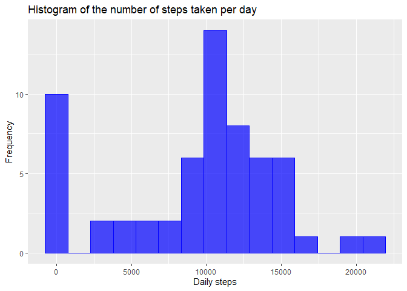
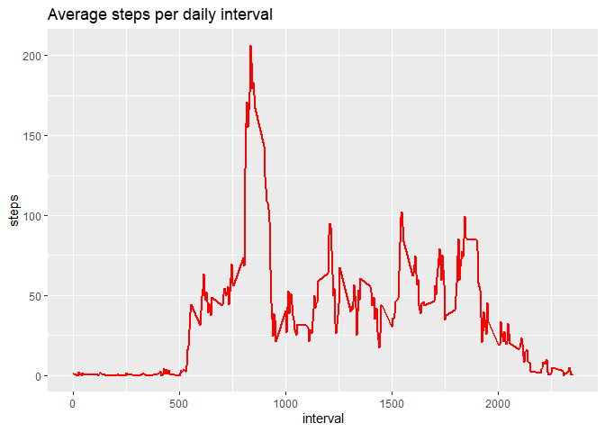
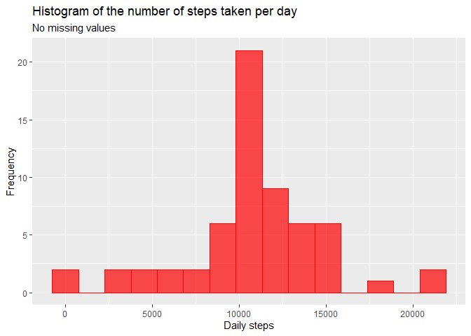
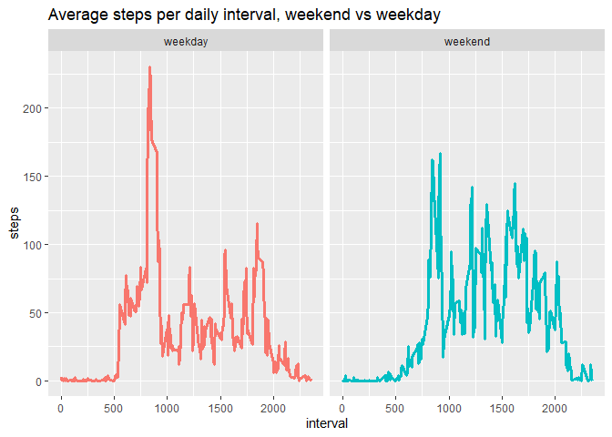

## Loading and preprocessing the data

```r
raw <- read.csv('activity.csv') %>% mutate(date = as.POSIXct(date, "%Y-%m-$d"))
```
Please note that the packages loaded for this assignment were tidyverse, formattable, zoo, and ggplot2. 


## What is mean total number of steps taken per day?

```r
steps_per_day <- raw %>% group_by(date) %>% summarise(steps_per_day = sum(steps, na.rm = T))

ggplot(data = steps_per_day, aes(x = steps_per_day)) + geom_histogram(fill = 'blue',color = 'blue', bins = 15, alpha = 0.7) + labs(title = 'Histogram of the number of steps taken per day', y = 'Frequency', x = 'Daily steps')
```

<!-- -->

```r
paste0('The average number of steps taken per day is ',comma(mean(steps_per_day$steps_per_day),1),'.')
```

```
## [1] "The average number of steps taken per day is 9,354.2."
```

```r
paste0('The median number of steps taken per day is ',comma(median(steps_per_day$steps_per_day),0),'.')
```

```
## [1] "The median number of steps taken per day is 10,395."
```


## What is the average daily activity pattern?

```r
daily_pattern <- raw %>% group_by(interval) %>% summarise(mean_per_interval = mean(steps, na.rm = T))

ggplot(data = daily_pattern, aes(x = interval, y = mean_per_interval)) + geom_line(color = 'red', size =1) + labs(title = 'Average steps per daily interval', x = 'interval', y = 'steps')
```

<!-- -->


## Imputing missing values

```r
paste0('There are ',nrow(raw) - nrow(raw %>% filter_all(~!is.na(.))),' rows with missing data.')
```

```
## [1] "There are 2304 rows with missing data."
```

```r
imputed <- raw %>% group_by(interval) %>% mutate_at(vars(steps), ~na.aggregate(.))
head(imputed)
```

```
## # A tibble: 6 x 3
## # Groups:   interval [6]
##    steps date                interval
##    <dbl> <dttm>                 <int>
## 1 1.72   2012-10-01 00:00:00        0
## 2 0.340  2012-10-01 00:00:00        5
## 3 0.132  2012-10-01 00:00:00       10
## 4 0.151  2012-10-01 00:00:00       15
## 5 0.0755 2012-10-01 00:00:00       20
## 6 2.09   2012-10-01 00:00:00       25
```


```r
imputed_steps_per_day <- imputed %>% group_by(date) %>% summarise(imputed_steps_per_day = sum(steps, na.rm = T))

ggplot(data = imputed_steps_per_day, aes(x = imputed_steps_per_day)) + geom_histogram(fill = 'red',color = 'red', bins = 15, alpha = 0.7) + labs(title = 'Histogram of the number of steps taken per day',subtitle = 'No missing values', y = 'Frequency', x = 'Daily steps')
```

<!-- -->

```r
paste0('The average number of steps taken per day is after imputing missing values is ',comma(mean(imputed_steps_per_day$imputed_steps_per_day),1),' while the unimputed average was ',comma(mean(steps_per_day$steps_per_day),1),'. This represents a difference of ',abs(comma(mean(steps_per_day$steps_per_day),1)-comma(mean(imputed_steps_per_day$imputed_steps_per_day),1)),' steps.')
```

```
## [1] "The average number of steps taken per day is after imputing missing values is 10,766.2 while the unimputed average was 9,354.2. This represents a difference of 1,412.0 steps."
```

```r
paste0('The median number of steps taken per day is after imputing missing values is ',comma(median(imputed_steps_per_day$imputed_steps_per_day),1),' while the unimputed median was ',comma(median(steps_per_day$steps_per_day),1),'. This represents a difference of ',abs(comma(median(steps_per_day$steps_per_day),1)-comma(median(imputed_steps_per_day$imputed_steps_per_day),1)),' steps.')
```

```
## [1] "The median number of steps taken per day is after imputing missing values is 10,766.2 while the unimputed median was 10,395.0. This represents a difference of 371.2 steps."
```

```r
paste0('Since the mean and median approached themselves after imputation, the resulting distribution is therefore less skewed (in fact not skewed at all since mean = median) than the raw set).')
```

```
## [1] "Since the mean and median approached themselves after imputation, the resulting distribution is therefore less skewed (in fact not skewed at all since mean = median) than the raw set)."
```


## Are there differences in activity patterns between weekdays and weekends?

```r
weekend <- suppressWarnings(imputed %>% mutate(weekday = weekdays(date),weekend = as.factor(ifelse(weekday %in% c('Saturday','Sunday'), 'weekend', 'weekday')))) %>% group_by(interval,weekend) %>% summarise(mean_per_interval = mean(steps, na.rm = T))

ggplot(data = weekend) + geom_line(aes(x = interval, y = mean_per_interval, color = weekend), show.legend = F, size = 1.1) + facet_wrap(~weekend) + labs(title = 'Average steps per daily interval, weekend vs weekday', x = 'interval', y = 'steps')
```

<!-- -->

